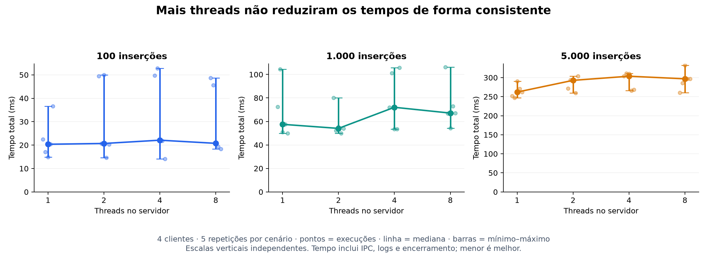

# Simulações e resultados — Projeto M1

## Resultado principal

A rodada final executou **60 medições e 122.000 inserções**, com **zero operações
perdidas, duplicadas ou com resposta inesperada**. Quatro aquecimentos adicionais
(4.000 inserções) foram excluídos das estatísticas. O teste funcional também passou.

Para 5.000 inserções, a mediana foi **0,262 s com uma thread**
e **0,304 s com quatro threads**. O tempo com quatro threads
foi 15,9% maior nessa amostra. Não foi observado ganho consistente
de desempenho ao ampliar o pool nesta carga e nesta máquina.

## Ambiente de execução

- Data da rodada: 2026-09-19T21:31:11.074935-03:00.
- Sistema: Windows-11-10.0.26200-SP0.
- Hardware: 12th Gen Intel(R) Core(TM) i5-12450HX, 8 núcleos e 12 processadores lógicos; 15,73 GiB de RAM utilizável pelo Windows.
- Compilador: g++ (MinGW.org GCC-6.3.0-1) 6.3.0.
- Flags: `-std=c++11 -Wall -Wextra -Wpedantic -Iinclude -static (sem -O)`.
- Python de automação: 3.12.14.
- Implementação: C++/Win32, named pipe, CreateThread, CreateMutexA e CreateSemaphoreA.
- Servidor com banco em vetor, mutex único do banco e mutex separado para log.

## Método

Foram combinados pools de **1, 2, 4 e 8 threads** com lotes de **100, 1.000 e
5.000 INSERTs**, sempre com **quatro processos clientes**. Cada cenário teve
cinco repetições. A ordem dos 60 ensaios foi embaralhada com semente 20260919.
Antes deles, houve um aquecimento de 1.000 inserções para cada tamanho de pool.

Cada execução iniciou um servidor novo e, portanto, um banco vazio. Os IDs foram
distintos, de 0 a N−1, distribuídos entre os quatro clientes. O tamanho do lote é
o total entre os clientes, não a quantidade enviada por cada cliente. Não foram
inseridos atrasos artificiais nem alterada a lógica do banco para favorecer threads.
A única mudança no programa foi permitir escolher o tamanho do pool por argumento;
a execução sem argumento continua usando quatro threads.

O cronômetro `time.perf_counter()` começou antes de despachar os envios e parou
após o servidor sair em resposta a PARAR. Assim, mede **tempo total do lote**,
incluindo IPC, sincronização, operações, saída em log, coordenação Python e
encerramento. As chamadas de criação dos processos ocorreram antes do cronômetro,
mas algum trabalho residual de inicialização dos clientes pode estar incluído.
A leitura dos logs para validação ocorreu depois da medição. Este valor não é
latência individual de uma requisição nem tempo exclusivo de processamento do banco.

O log do servidor permaneceu ativo, com flush por resposta. A saída de console
do servidor foi redirecionada para outro arquivo; a saída normal do cliente foi
descartada. Rodar com terminais visíveis pode produzir tempos diferentes.

Uma rodada preliminar ocorreu enquanto se instalava a biblioteca de gráficos.
Ela foi preservada, mas **não entrou em nenhuma estatística abaixo**. A rodada
final começou depois que essa instalação terminou. O computador não foi isolado
de toda atividade de fundo do Windows.

## Tabela de resultados

| Requisições | Threads | Mediana (s) | Média ± DP (s) | Mín.–máx. (s) | Vazão (req/s) | Aceleração |
|---:|---:|---:|---:|---:|---:|---:|
| 100 | 1 | 0,0204 | 0,0223 ± 0,0085 | 0,0149–0,0365 | 4.912 | 1,00× |
| 100 | 2 | 0,0207 | 0,0310 ± 0,0173 | 0,0146–0,0500 | 4.834 | 0,98× |
| 100 | 4 | 0,0221 | 0,0321 ± 0,0178 | 0,0141–0,0528 | 4.526 | 0,92× |
| 100 | 8 | 0,0207 | 0,0306 ± 0,0152 | 0,0184–0,0487 | 4.820 | 0,98× |
| 1000 | 1 | 0,0575 | 0,0671 ± 0,0228 | 0,0498–0,1046 | 17.380 | 1,00× |
| 1000 | 2 | 0,0541 | 0,0583 ± 0,0124 | 0,0499–0,0801 | 18.493 | 1,06× |
| 1000 | 4 | 0,0720 | 0,0772 ± 0,0253 | 0,0534–0,1059 | 13.882 | 0,80× |
| 1000 | 8 | 0,0671 | 0,0735 ± 0,0196 | 0,0543–0,1064 | 14.901 | 0,86× |
| 5000 | 1 | 0,2620 | 0,2643 ± 0,0172 | 0,2471–0,2904 | 19.082 | 1,00× |
| 5000 | 2 | 0,2928 | 0,2842 ± 0,0181 | 0,2594–0,3037 | 17.075 | 0,89× |
| 5000 | 4 | 0,3037 | 0,2918 ± 0,0229 | 0,2659–0,3111 | 16.466 | 0,86× |
| 5000 | 8 | 0,2968 | 0,2945 ± 0,0258 | 0,2607–0,3323 | 16.844 | 0,88× |

Cada linha resume cinco medições. DP é o desvio padrão amostral. Vazão = N dividido
pela mediana do tempo. Aceleração = mediana com uma thread / mediana do cenário,
para o mesmo volume. Valor abaixo de 1 indica tempo maior que o da referência.

## Gráfico

As barras mostram mínimo e máximo, **não intervalo de confiança**. Os pontos
mostram as cinco execuções. As escalas verticais são independentes entre painéis.

## Verificação de funcionamento

Ao final de cada lote, o programa de simulação verificou todas as respostas do
log, a quantidade de linhas, a correspondência ID/nome, o conjunto completo de
IDs e a identificação das threads. Também exigiu código de saída zero de todos
os clientes e do servidor. Todos os lotes foram aprovados.

Separadamente, `testes/testar.py` validou INSERT, SELECT, UPDATE e DELETE, entradas
inválidas, consulta de registro inexistente, rejeição de duplicatas e encerramento.
Na disputa de 12 clientes pelo mesmo ID, houve uma inserção aceita e 11 rejeitadas.
Esses resultados estão em `teste_funcional.txt`. **Os tempos da tabela são apenas
de INSERT; não são benchmarks de SELECT, UPDATE ou DELETE.**

| Pool | Operações concluídas por cada thread (cinco lotes de 5.000) | Total |
|---:|---|---:|
| 1 | T1: 25000 | 25000 |
| 2 | T1: 12473; T2: 12527 | 25000 |
| 4 | T1: 6244; T2: 6255; T3: 6247; T4: 6254 | 25000 |
| 8 | T1: 3125; T2: 3126; T3: 3126; T4: 3123; T5: 3127; T6: 3124; T7: 3124; T8: 3125 | 25000 |

Essas contagens mostram que as threads do pool realizaram trabalho; não demonstram
execução simultânea dentro do banco. A seção crítica do banco é exclusiva.

## Análise e discussão

O aumento do pool não reduziu os tempos de maneira consistente. No maior lote,
uma thread apresentou a menor mediana entre as configurações avaliadas. Nos lotes
menores, a variação entre repetições é grande em relação às diferenças entre
configurações; pequenas vantagens isoladas não sustentam uma conclusão geral.

A arquitetura ajuda a explicar o resultado: INSERT precisa adquirir um mutex
único, e a busca de ID no vetor também ocorre dentro dessa seção crítica. Logo,
as operações sobre o banco ficam serializadas. Além disso, cada comando abre uma
conexão no named pipe, o servidor recebe uma conexão de cada vez e as respostas
passam por um log sincronizado com flush. Acrescentar threads adiciona coordenação
sem remover essas etapas serializadas. São explicações compatíveis com o código;
o experimento não mediu separadamente o custo de cada etapa.

O projeto demonstrou comunicação entre processos, uso de um pool e proteção dos
dados sob concorrência. **Concorrência correta não implica aceleração**. Não se
deve afirmar, com esses dados, que quatro threads processam o banco quatro vezes
mais rápido, nem generalizar os resultados para outros bancos e cargas.

As principais limitações são: cinco repetições por cenário, lotes curtos, uma
única máquina, banco inicialmente vazio, carga somente de inserção, compilação
sem otimização explícita e custos de IPC/log incluídos. Não foram medidos CPU,
memória, percentis de latência ou intervalos de confiança. Uma avaliação futura
pode usar lotes maiores e mais repetições, além de comparar cargas de consulta
e atualização com preparação e barreiras que preservem a ordem das dependências.

## Reprodução e evidências

1. Na pasta do projeto, execute `compilar.bat`.
2. Feche qualquer servidor manual e execute `python testes/simular.py`.
3. Uma nova pasta será criada em `resultados`, com `dados.json` e logs por execução.
4. Para recriar tabelas e gráficos, instale matplotlib no seu ambiente Python e
   execute `python testes/analisar.py CAMINHO_DO_DADOS_JSON`.

`dados.json` contém tempos sem arredondamento, ordem dos ensaios, distribuição por
thread e hashes SHA-256 dos fontes, executáveis e simulador. `resumo.json` contém
as estatísticas derivadas. As pastas `exec_*` guardam os logs individuais e as
pastas `aquecimento_*` guardam as execuções excluídas da análise. A rodada usada
neste texto é **simulacao_20260919_213111**.

Este texto é uma seção de resultados pronta para adaptação ao relatório do trio;
não substitui identificação dos autores, enunciado e demais elementos acadêmicos.
